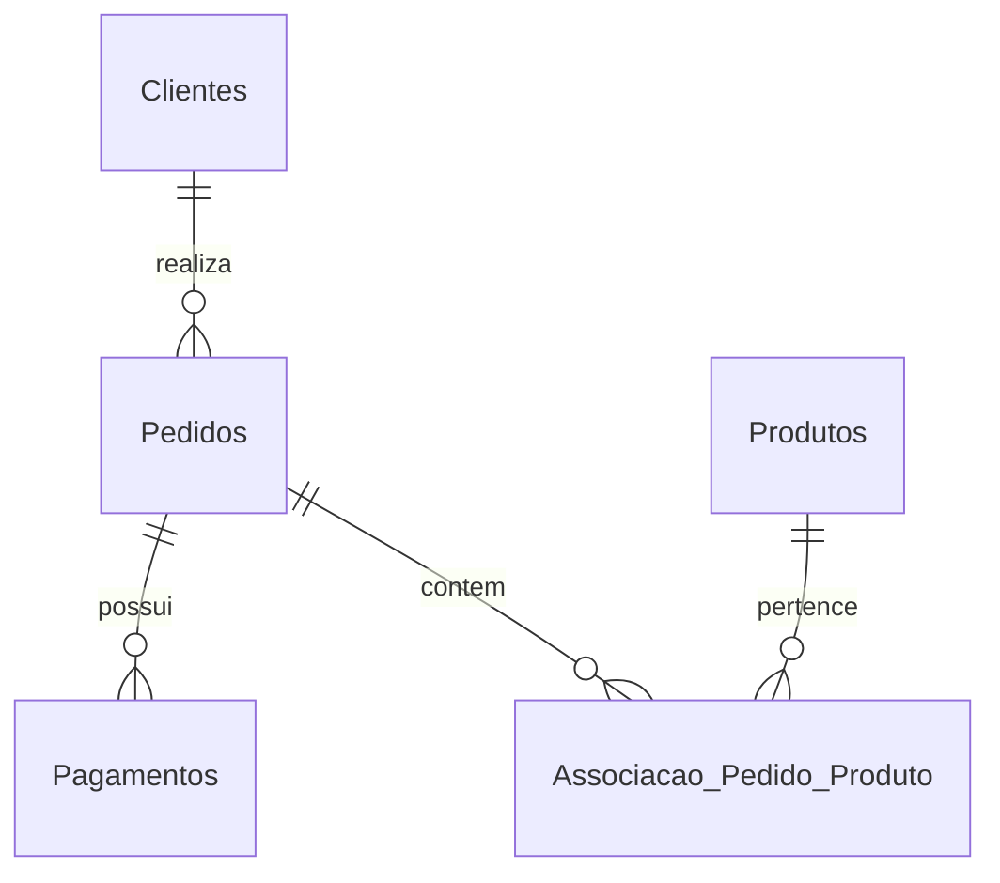

# 🍔 Tech Challenge – Documentação do Projeto

---

## 📌 Introdução do Problema

O sistema visa digitalizar o processo de pedidos em uma rede de fast food por meio de uma **aplicação de autoatendimento**. Os clientes poderão montar seus pedidos, visualizar o andamento e retirá-los no balcão assim que estiverem prontos.

### Objetivos:

- Reduzir o tempo de atendimento.
- Diminuir erros operacionais.
- Automatizar a visualização de pedidos em tempo real.
- Permitir integração futura com métodos de pagamento.

---

## ⚡ Inclusão do Event Storming

Durante o processo de modelagem, utilizamos a técnica de **Event Storming** para mapear os principais eventos, comandos e agregados do domínio.

### Atores:
- `Cliente`
- `Atendente`
- `Cozinha`
- `Estabelecimento`

### Agregados:
- `Pedido`
- `Cliente`
- `Pagamento`
- `Cozinha`
- `Atendente`


### Eventos mapeados:


### Event Storming - Etapa 1 (Organizando os Eventos):


### Event Storming - Etapa 2 (Adição dos Eventos Pivotais):
 

### Event Storming - Etapa 3 (Fluxo Completo):


### Event Storming - Etapa 4 (Fluxo Verticalizado):


O Event Storming permitiu visualizar o fluxo completo de domínio e estabelecer os **bounded contexts** com clareza.


> 📌 **Event Storming**: É possível acessar o Event Storming no Miro [aqui](https://miro.com/app/board/uXjVI_TRUv8=/?share_link_id=237320070737).

---

## 📖 Dicionário de Linguagem Ubíqua

Este dicionário define os principais termos usados no domínio da aplicação para garantir comunicação clara entre todos os envolvidos.

---

### 🧑‍🍳 Cliente
Pessoa que acessa o sistema de autoatendimento para realizar um pedido.

- Pode ou não se identificar com **CPF**, **nome** e **e-mail**.
- Pode montar um **combo** com os itens desejados.

---

### 🧾 Pedido
Conjunto de itens selecionados pelo cliente, podendo conter:

1. **Lanche**  
2. **Acompanhamento**  
3. **Bebida**  
4. **Sobremesa**

- O pedido segue por um fluxo de **status** (Recebido → Em preparação → Pronto → Finalizado).
- Só entra na cozinha após a **confirmação do pagamento**.

---

### 🍔 Combo
Conjunto opcional de produtos do pedido (lanche, acompanhamento, bebida, sobremesa), montado pelo cliente.

---

### 💳 Pagamento
Processo de finalização do pedido.

---

### 🧑‍🍳 Cozinha
Responsável por **preparar os pedidos** assim que forem confirmados.

- Recebe os pedidos em tempo real após pagamento.
- Atualiza os status de preparo.

---

### 📺 Monitor de Acompanhamento
Tela (física ou digital) onde o cliente visualiza o **progresso do pedido**.

Status possíveis:

- Recebido  
- Em preparação  
- Pronto  
- Finalizado

---

### 🛎️ Retirada
Etapa final do pedido. O sistema **notifica o cliente** quando o pedido está **pronto para retirada**.

---

### 🧑‍💼 Painel Administrativo
Interface usada pelo estabelecimento para **gestão interna**, com as seguintes funcionalidades:

- Gerenciar clientes
- Gerenciar produtos e categorias
- Acompanhar pedidos em andamento
- Visualizar tempo de espera

---

### 🛍️ Produto
Item disponível para escolha do cliente, com:

- Nome
- Categoria (Lanche, Acompanhamento, Bebida, Sobremesa)
- Preço
- Descrição
- Imagem

---

### 🗂️ Categoria
Classificação fixa de produtos no sistema:

- **Lanche**
- **Acompanhamento**
- **Bebida**
- **Sobremesa**

---

### 🧑‍💻 Identificação
Processo opcional onde o cliente informa **CPF**, **nome** e **e-mail**.  
Permite o estabelecimento:

- Reconhecer clientes frequentes
- Criar campanhas promocionais futuras

---

### 📦 Checkout
Ato de **finalizar e confirmar o pedido**, enviando-o para a fila da cozinha.

- Pagamento realizado via **QRCode** através do **Mercado Pago**.

---

### 🔄 Fila de Pedidos
Organização dos pedidos em espera no sistema, com tempo de entrada e status de avanço no processo de preparação.

---

### 🧰 Infraestrutura

- A aplicação será entregue como um **monolito**

---
## 📚 Requisitos do Sistema

### Requisitos de Negócio
- Cadastro e login de clientes (opcional).
- Criação de pedidos personalizados: lanche, acompanhamento, bebida e sobremesa.
- Pagamento por QRCode (Mercado Pago).
- Acompanhamento dos pedidos.
- Painel administrativo com:
  - Gerenciamento de produtos por categoria.
  - Acompanhamento de pedidos.
- APIs RESTful seguindo padrões Clean Code + Clean Architecture.

### Requisitos de Infraestrutura
- Orquestração com Kubernetes (K8s) utilizando Minikube.
- Suporte à escalabilidade com Horizontal Pod Autoscaler (HPA).
- Deploys via Deployments + Services.
- Armazenamento de configurações com ConfigMaps.
- Armazenamento de dados sensíveis com Secrets.

### ☁️ Kubernetes – Componentes Utilizados

| Componente   | Descrição                                               |
|--------------|---------------------------------------------------------|
| `Deployment` | Garante replicação e atualização do pod                 |
| `Service`    | Exposição interna dos pods                              |
| `HPA`        | Escalabilidade automática com base em CPU               |
| `ConfigMaps` | Parametrizações e variáveis não sensíveis               |
| `Secrets`    | Armazenamento de tokens/segredos (ex: API Mercado Pago) |
| `Volume`     | Persistência de dados                              |


---

### Desenho da Arquitetura


---

## 🛠️ Tecnologias e Ferramentas

- **Spring Boot**: Backend REST
- **JPA / Hibernate**: Persistência
- **PostgreSQL**: Banco de dados
- **Docker**: Contêiner da aplicação
- **Minikube (Kubernetes)**: Orquestração
- **Swagger**: Documentação das APIs
- **Mercado Pago**: Gateway de pagamento (via QR Code)

---

## 🛠️ APIs do Sistema

- Cadastro do Cliente  
- Identificação via CPF  
- CRUD de Produtos  
- Busca de produtos por categoria  
- Fake checkout  
- Listagem de pedidos

---

### 🧪 Swagger

Documentação interativa das APIs REST disponibilizadas no backend.

---

> 📌 **Importância**: Essa linguagem ubíqua será utilizada nos eventos de Event Storming, modelagem tática e implementação do sistema, evitando ambiguidades e ruídos de comunicação.

---
## 🗃️ Banco de Dados

O banco de dados escolhido para o projeto foi o PostgreSQL, devido à sua robustez, conformidade com o padrão ACID e suporte avançado a relacionamentos complexos entre entidades. Como o sistema exige integridade referencial, consistência transacional e regras de negócio bem definidas, a adoção de um modelo relacional torna-se essencial para garantir a confiabilidade e previsibilidade das operações. Além disso, o PostgreSQL oferece alta escalabilidade, suporte a consultas SQL complexas, funções customizadas e integrações nativas com containers e orquestradores como Kubernetes, o que o torna ideal para aplicações comlexas e escaláveis. Sua flexibilidade e desempenho permitem lidar eficientemente com o volume crescente de dados e a evolução das necessidades do sistema, assegurando qualidade, segurança e manutenção simplificada ao longo do ciclo de vida da aplicação.

## 🔗 Relacionamentos (DER)



---

### 🗂️ Modelagem de Dados

#### **1. Clientes**
Armazena informações dos clientes do restaurante.

| Campo          | Tipo        | Restrições | Descrição |
|----------------|-------------|-------------|------------|
| id             | SERIAL      | PK          | Identificador único do cliente |
| nome           | VARCHAR(255) | NOT NULL  | Nome completo do cliente |
| email          | VARCHAR(255) |            | E-mail de contato |
| telefone       | VARCHAR(20)  |            | Telefone de contato |
| cpf            | VARCHAR(14)  | UNIQUE     | CPF do cliente |
| endereco       | TEXT         |            | Endereço completo |
| data_criacao   | TIMESTAMP    | DEFAULT now() | Data de registro |


#### **2. Produtos**
Representa os itens do cardápio.

| Campo        | Tipo          | Restrições | Descrição |
|--------------|---------------|-------------|------------|
| id           | SERIAL        | PK          | Identificador único do produto |
| nome         | VARCHAR(255)  | NOT NULL    | Nome do produto |
| categoria    | VARCHAR(255)  |             | Categoria do produto (Ex: Bebida, Sobremesa) |
| preco        | DECIMAL(10,2) | NOT NULL    | Preço unitário |
| descricao    | TEXT          |             | Descrição do produto |
| imagem       | TEXT          |             | URL/Path da imagem |
| data_criacao | TIMESTAMP     | DEFAULT now() | Data de criação |


#### **3. Pedidos**
Registra os pedidos feitos pelos clientes.

| Campo                   | Tipo        | Restrições | Descrição |
|--------------------------|-------------|-------------|------------|
| id                       | SERIAL      | PK          | Identificador único do pedido |
| cliente_id               | INT         | FK → Clientes(id) | Cliente que realizou o pedido |
| status                   | VARCHAR(50) |             | Status do pedido (Ex: Em preparo, Entregue) |
| data_hora_inclusao_pedido| TIMESTAMP   | DEFAULT now() | Data e hora da inclusão |


#### **4. Pagamentos**
Armazena informações sobre o pagamento de cada pedido.

| Campo        | Tipo          | Restrições | Descrição |
|--------------|---------------|-------------|------------|
| id           | SERIAL        | PK          | Identificador único do pagamento |
| pedido_id    | INT           | FK → Pedidos(id), NOT NULL | Pedido associado |
| valor        | DECIMAL(10,2) | NOT NULL    | Valor pago |
| id_mercado_pago | VARCHAR(255) |         | Identificador da transação no Mercado Pago |
| status       | VARCHAR(50)   |             | Status do pagamento |
| data_criacao | TIMESTAMP     | DEFAULT now() | Data de criação do registro |


#### **5. Associação Pedido-Produto**
Tabela de relacionamento **N:N** entre `Pedidos` e `Produtos`.

| Campo        | Tipo          | Restrições | Descrição |
|--------------|---------------|-------------|------------|
| pedido_id    | INT           | PK, FK → Pedidos(id) | Pedido associado |
| produtos_id  | INT           | PK, FK → Produtos(id) | Produto associado |
| quantidade   | INT           | NOT NULL    | Quantidade do produto no pedido |
| preco        | DECIMAL(10,2) | NOT NULL    | Preço unitário no momento do pedido |

---

## ▶️ Como Rodar o Projeto

## Pré-requisitos

Antes de iniciar o processo, garanta que:
- Você possui acesso ao **laboratório AWS** e as permissões adequadas (IAM, RDS, EKS e S3);
- Todos os repositórios abaixo estão devidamente clonados:
  - [infra-restaurante-postech](https://github.com/Pos-Tech-Turma-81/infra-restaurante-postech)
  - [infra-rds-postgres](https://github.com/Pos-Tech-Turma-81/infra-rds-postgres)
  - [tech-challenge-sa](https://github.com/Pos-Tech-Turma-81/tech-challenge-sa)
  - [infra-api-gateway](https://github.com/Pos-Tech-Turma-81/infra-api-gateway)
  - [lambda-postech-authorizer](https://github.com/Pos-Tech-Turma-81/lambda-postech-authorizer)
- Você possui o **AWS CLI**, **kubectl**, **Terraform**, **Docker**, e **Minikube** configurados em sua máquina.

---

## Passo a Passo

### 1. Iniciar o Laboratório AWS
Ative o ambiente de laboratório da AWS para permitir a execução das ações e pipelines de infraestrutura.

- Crie um bucket na S3 e guarde o nome do mesmo

---

### 2. Configuração do Repositório `infra-restaurante-postech`

1. Atualize as variáveis de ambiente no ambiente `actions`.
2. No arquivo `main.tf`, altere o nome do bucket na variável `bucket` (linha 3).
3. Crie um Pull Request (PR) para a branch `main`.
4. Aguarde a execução da **Pipeline** de CI/CD até a conclusão.

---

### 3. Configuração do Repositório `infra-rds-postgres`

1. Atualize as variáveis de ambiente no ambiente `actions`.
2. No arquivo `main.tf`, altere o nome do bucket na variável `bucket` (linha 3).
3. Crie um Pull Request (PR) para a branch `main`.
4. Aguarde a execução da **Pipeline** de CI/CD até a conclusão.

---

### 4. Configuração do Repositório `lambda-postech-authorizer`

1. Atualize as variáveis de ambiente no ambiente `actions`.
2. No arquivo `main.tf`, altere o nome do bucket na variável `bucket` (linha 3).
3. Crie um Pull Request (PR) para a branch `main`.
4. Aguarde a execução da **Pipeline** de CI/CD até a conclusão.

---

### 5. Configuração Local do Banco de Dados

1. Realize a conexão com o banco PostgreSQL utilizando os dados abaixo:

   ```
   username: adminuser
   password: SenhaForte123!
   database: postgres_restaurante
   port: 5432
   ```

2. Cole o schema SQL abaixo no console de queries e execute:

```sql
CREATE SCHEMA restaurante_schema;

CREATE TABLE restaurante_schema.Clientes (
      id SERIAL,
      nome VARCHAR(255),
      email VARCHAR(255),
      telefone VARCHAR(20),
      cpf VARCHAR(14),
      endereco TEXT,
      data_criacao TIMESTAMP DEFAULT CURRENT_TIMESTAMP,
      PRIMARY KEY (id)
    );

    CREATE TABLE restaurante_schema.Produtos (
        id SERIAL,
        nome VARCHAR(255) NOT NULL,
        categoria VARCHAR(255),
        preco DECIMAL(10, 2) NOT NULL,
        descricao TEXT,
        imagem TEXT,
        data_criacao TIMESTAMP DEFAULT CURRENT_TIMESTAMP,
        PRIMARY KEY (id)
    );

    CREATE TABLE restaurante_schema.Pedidos (
        id SERIAL,
        cliente_id INT,
        status VARCHAR(50),
        data_hora_inclusao_pedido TIMESTAMP DEFAULT CURRENT_TIMESTAMP,
        PRIMARY KEY (id),
        FOREIGN KEY (cliente_id) REFERENCES restaurante_schema.Clientes(id)
    );

    CREATE TABLE restaurante_schema.Pagamentos (
        id SERIAL,
        pedido_id INT NOT NULL,
        valor DECIMAL(10, 2) NOT NULL,
        id_mercado_pago VARCHAR(255),
        status VARCHAR(50),
        data_criacao TIMESTAMP DEFAULT CURRENT_TIMESTAMP,
        PRIMARY KEY (id),
        FOREIGN KEY (pedido_id) REFERENCES restaurante_schema.Pedidos(id)
    );

    CREATE TABLE restaurante_schema.Associacao_Pedido_Produto (
        pedido_id INT NOT NULL,
        produtos_id INT NOT NULL,
        quantidade INT NOT NULL,
        preco DECIMAL(10, 2) NOT NULL,
        PRIMARY KEY (pedido_id, produtos_id),
        FOREIGN KEY (pedido_id) REFERENCES restaurante_schema.Pedidos(id),
        FOREIGN KEY (produtos_id) REFERENCES restaurante_schema.Produtos(id)
    );
```

---

### 6. Configuração da Conexão RDS + EKS

1. No painel da AWS, acesse o serviço **Amazon RDS** → **Databases** → `postgres-restaurante`.
2. Copie o **endpoint** listado na aba **Connectivity & Security**.
3. No terminal, execute o comando abaixo para configurar o acesso ao cluster EKS:

   ```bash
   aws eks update-kubeconfig --region us-east-1 --name eks-fargate-eks_cluster_restaurante
   ```

4. Crie uma nova branch no repositório `tech-challenge-sa`.
5. No arquivo `./infra/kubernetes/restaurante-app/restaurante-app-configmap.yaml`, atualize o valor da variável `DB_HOST` com o endpoint copiado.
6. Abra um PR da branch criada para a branch `main` e mergeie, dessa forma o pipeline de CI/CD irá realizar o deploy da aplicação.

---

### 7. Acesso à Aplicação no Amazon EKS

1. No painel da AWS, acesse o serviço **Amazon EKS**.
2. Vá em **Clusters** → selecione o cluster `eks-fargate-eks_cluster_restaurante`.
3. Localize o serviço `svc-restaurante-app`.
4. Copie o valor da **URL do Load Balancer**. Essa será a URL base da API, utilizada posteriormente no **API Gateway**.

---

### 8. Configuração do Repositório `infra-api-gateway`

1. Atualize as variáveis de ambiente no ambiente `actions`.
2. Crie uma nova branch
3. Na sua branch, no arquivo `main.tf`, altere o nome do bucket na variável `bucket` (linha 3).
4. Acesse o workflow de [deploy](https://github.com/Pos-Tech-Turma-81/infra-api-gateway/actions/workflows/deploy.yaml)
5. Clique em **Run Workflow**
6. No painel, selecione a sua branch e no campo `URL base do backend` cole a **URL do Load Balancer** copiada no passo anterior
7. Clique em **Run Workflow** novamente
8. Aguarde a execução da **Pipeline** de CI/CD até a conclusão.

---

### 9. Finalização e Desativação do Ambiente

Após a execução e validação da aplicação:

1. Acesse os repositórios `infra-restaurante-postech`, `lambda-postech-authorizer` e `infra-rds-postgres`.
2. Abra uma **issue** do tipo **destroy** em cada um deles.
3. Acesse o repositório `infra-api-gateway`
4. Acesse o workflow de [destroy](https://github.com/Pos-Tech-Turma-81/infra-api-gateway/actions/workflows/destroy.yml)
5. Clique em **Run Workflow**
6. No painel, selecione a sua branch
7. Clique em **Run Workflow** novamente
8. Esses passos acionarão uma **GitHub Action** que desativará automaticamente o ambiente.

---
